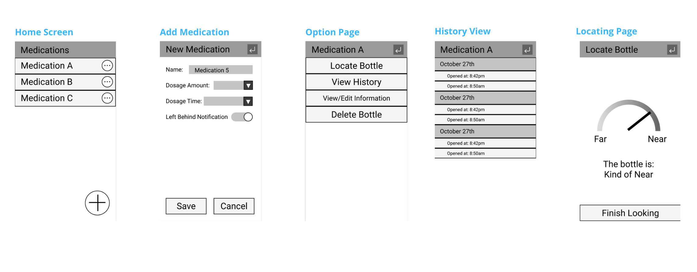
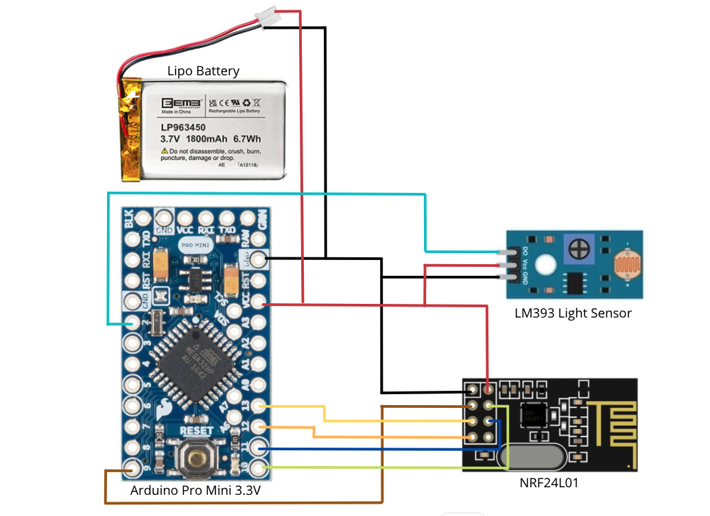

<!--# PillPal: Your Smart Pill Bottle -->
<!-- insert logo here -->

  

<!-- this is where we'd put a video if we had one -->

## Story
<!-- provide background and context for why we decided to make PillPal (besides it being for our capstone class). who is our target audience? why does our product matter and what new aspects does it bring to the smart pill bottle market? -->
Taking medication is an essential part of maintaining health for millions of people worldwide. However, up to 50% of people take their medication incorrectly. Missing pills or not being able to find your medication are problems that those who rely on prescription medications face. Out of all current smart pill bottles on the market, PillPal offers the simplest, low-effort solution for managing and keeping track of multiple medications. Simply open the lid for the app to track when you've taken your medication - no additional button presses or phone taps needed!

   
  

## How To Use PillPal
<!-- walk through the process of setting up/registering a bottle, editing information, what type of notifications will happen -->

1. Register your PillPal bottle(s) with your phone
2. Enter in prescription information into the app
3. Get reminders (phone or friendly)

## Features
* Medication Reminders
* Week-long battery life
* Medication Proximity Detection
* Usage History
* Personalizable Labels

## UI Design

## Specification
* Materials: PLA
* Dimensions: 6.35cm x 5.35cm x 8.25cm
* Volume: 20 dram
* Weight: 130g

## Materials and Budget
<!-- need a chart -->

## Circuit Schematic

## Stretch Goals
<!-- additional goals for the pillpal -->
* Child Safety Lid
* Medication Remainder Detection
* Prescription Refills

## Timeline
<!-- hopefully visual timeline of how we will continue developing the pillpal. can (will) definitely be full of lies. this section isn't necessary -->

## Meet The Team
### Alex Eidt

Alex is a BS student at the University of Washington studying Electrical Engineering. He's interested in computer vision and image processing. In his free time, he enjoys biking, playing basketball and working on coding projects.

### Peter Gunarso

Peter is a BS student at the University of Washington studying Computer Engineering. He's interested in all the different ways computing can effect daily life. Outside of school or work, you can find him at the gym or playing with his dog.

### Sunny Hu

Sunny is an undergraduate student at the University of Washington studying Eletrical Engineering. She's interested in embedded software and STEM education. In her spare time, you can find her trying new foods or enjoying the rare PNW sunshine.

### Edward Wu

Edward is a undergraduate student at the University of Washington studying Electrical Engineering. He is passionate about hardware & software programming, firmware design. In his free time, he likes painting and playing basketball. 
