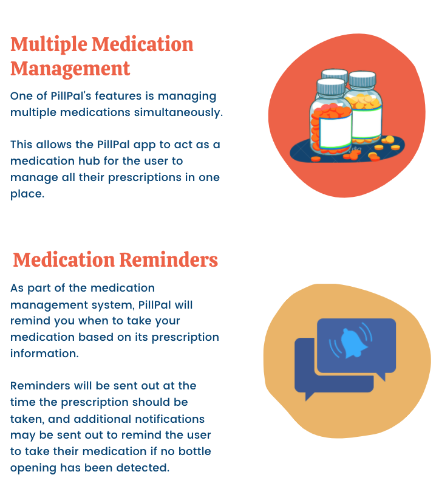
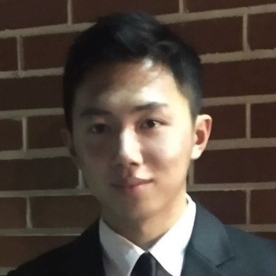

  

## Story
<!-- provide background and context for why we decided to make PillPal (besides it being for our capstone class). who is our target audience? why does our product matter and what new aspects does it bring to the smart pill bottle market? -->
Taking medication is an essential part of maintaining health for millions of people worldwide. However, up to 50% of people take their medication incorrectly. Missing pills or not being able to find your medication are problems that those who rely on prescription medications face. Out of all current smart pill bottles on the market, PillPal offers the simplest, low-effort solution for managing and keeping track of multiple medications. Simply open the lid for the app to track when you've taken your medication - no additional button presses or phone taps needed!

   
  

  

## How To Use PillPal
Click on the thumbnail to open the video in a new tab.
<!-- walk through the process of setting up/registering a bottle, editing information, what type of notifications will happen -->

* Register your PillPal bottle(s) with your phone
<!-- Demo Videos - Adding Information -->

* Get notification remiders

 

* Find your bottle with our bottle locator
<!-- Demo Videos - Stud Finding -->
* Check your Dosage History
<!-- Demo Videos - Dosage Notifications. need cut from 0:47 to the end -->

<!-- * "Time to take medication" notification
* refill notification
* "left behind" notifications -->

  

## Features

   
  
  

  

## UI Design

   
  
  

  

## Specification
* Materials: PLA
* Dimensions: 5.4cm x 5.6cm x 10.55cm / 2.1in x 2.2in x 4.2in
* Volume: 20 dram
* Weight: 132g

  

## Future Work

The PillPal project is still very much in development. With your help kickstarting this product, we'll deliver some great new features to improve the user experience and safety.

One of those features is a child safety lid, which comes standard in most regular pill bottles. 

Additionally, a form of medication amount detection will offer a more robust means of tracking how much medication is left in your bottle.

We also plan on removing the tedious process of transcribing prescription information into the app by implementing a prescription scanner which will automatically fill in all medication information from a picture. 

<!-- ## Timeline hopefully visual timeline of how we will continue developing the pillpal. can (will) definitely be full of lies. this section isn't necessary -->

  

## Meet The Team
### Alex Eidt

Alex is a BS student at the University of Washington studying Electrical Engineering. He's interested in computer vision and image processing. In his free time, he enjoys biking, playing basketball and working on coding projects.

### Peter Gunarso

Peter is a BS student at the University of Washington studying Computer Engineering. He's interested in all the different ways computing can effect daily life. Outside of school or work, you can find him at the gym or playing with his dog.

### Sunny Hu

Sunny is an undergraduate student at the University of Washington studying Eletrical Engineering. She's interested in embedded software and STEM education. In her spare time, you can find her trying new foods or enjoying the rare PNW sunshine.

### Edward Wu

Edward is a undergraduate student at the University of Washington studying Electrical Engineering. He is passionate about hardware & software programming, firmware design. In his free time, he likes painting and playing basketball. 
